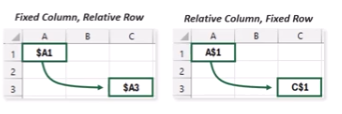
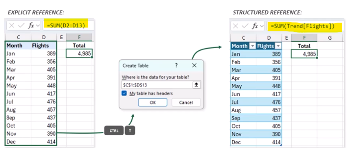

## ⚓ Spreadsheet Fundamentals ⚓
* A **spreadsheet** is a **grid of cells** arranged into rows and columns. 
  * Each **cell** can only store **one data type** (numbers, dates, text, or binary)
  * You can **sort and filter** data in a table in **ascending or descending** order
    * or you can filter manually using a specific condition based on its data type
  
### ✅ Data Validation ✅
* Allows you to limit the values that a **cell** will accept
  * You can also add **dropdown** lists and **checkboxes** to cells to facilitate user input

### 📊 Conditional Formatting 📊
* Allows you to format **cells** that meet a criteria
  * Examples include **color scales, data bars, or icon sets**
  * 

## 🧮 Formula & Function Syntax 🧮
* **Formulas** are calculations that a performed in cells that start with "="
* **Functions** are preset calculations used in formulas that take arguments as inputs between ( ) and return an output

### ➗ Function Syntax ➗
* `=SUMIF(range, criteria, [sum_range])`
  * **arguments** are surrounded by **parentheses** and separated by commas
  * **optional arguments** are surrounded by brackets

#### ➕ Types of Functions ➕
1. Traditional functions that return **one value** 
    * ex: `=SUM(D2:D32)` - adds all the values in the specified range
2. **Array functions** that return **multiple values**
    * ex: `=UNIQUE(C2:C9)` - returns a list of unique cell values
3. **Volatile functions** that recalculate automatically
    * `=NOW()` - returns the current date and time

### Reference Types
* Use a `$` to determine how row and column referneces change when formulas are copied to new cells. 
  - 🔓**Relative** `(A1)` = **Both** the **column** (A) and **row** (1) references can change
  
     
  - 🔒**Fixed** `($A$1)` = **Neither** the **column** (A) **nor** the **row** (1) reference can change
  
     
  - 🔣**Mixed** `($A1, A$1)` = **Row or column** references may change, depending on which one is fixed
  
     
* The `$` sign "locks" either the column or row, making it easier to create formulas based on a value of the referenced cell 
⭐**Pro-Tip: Press F4 to cycle between reference types**

#### **Explicit** References 🔢
* These are the traditional A1-style cell refs. that Excel uses by default
* Format is `(D2:D13)`

#### **Structured** References 🏷️
* These are applied when you reference cells within a table (vs. a range), and include the entire table and column names
* Format is `TableName[ColumnName]`
  

## ❗ Common Error Types ❗
* **#NAME?**: Function **name isn't recognized**
  * 🔧: Make sure the name is correct, refs. are valid, `" "` and `:` are in place

* **#VALUE!**: Function has the **wrong type of argument**
  * 🔧: Make sure you are **applying the correct operation based on the cell type** 
    * *Example*: you can't preform arithmetic operations on text strings
 
* **#NUM!**: Function has an **invalid number** or argument
* 🔧: Check the function's arguments and ensure they are valid numbers
  * *Example*: `SQRT(-1)` will return this error because you can't take the square root of a negative number

* **#DIV/0!**: Formula is **dividing by zero** or an empty cell
  * 🔧: If 0 is correct, use an `IF` statement to display the alternate value 
  * *Example*: `=IF(B2=0, "N/A", A2/B2)` will return "N/A" if B2 is 0, otherwise it will perform the division

* **#REF!**: Formula refers to a **cell that is not valid**
  * 🔧: Make sure you didn't alter cells that are ref'd in your formula
  * *Example*: If you delete a row or column that a formula refers to, it will return this error

* **#N/A!**: A **lookup function didn't find a match**
  * 🔧: Check lookup keys and ranges; if no match is correct, use an `IF` statement
  * *Example*: `VLOOKUP("Apple", A1:B10, 2, FALSE)` will return this error if "Apple" is not found in the first column of the range

* **#SPILL!**: Something is preventing a formula from returning multiple values
  * 🔧: Check for **merged cells** or **data in the spill range** that is preventing the output
  * *Example*: If you use `=SEQUENCE(5)` in a cell that has data in the next 5 cells, it will return this error

