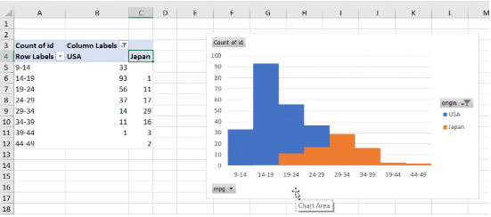
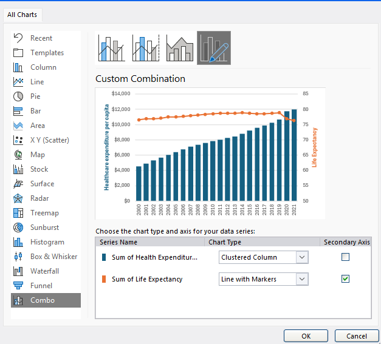
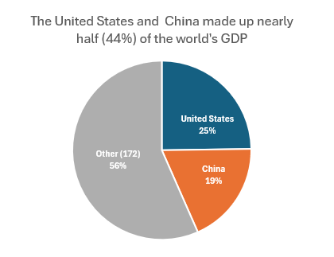

### Histogram chart

Basic guidelines:

* Continuous **numerical data**
* See how often different ranges of values appear in your data
* A large dataset you want to summarize quickly
* Each bin (x-axis) will have a different frequency (y-axis)

* Changing the *number of bins* in a histogram can help provide additional perspective about a variable's distribution.
  

  **Right-Skewed Distribution**
    

  **Left-Skewed Distribution**
      

#### You can plot **multiple Histogram charts** by using a PivotChart!
  1. Create a new PivotTable, Filtering the columns to only use the labels of the two histogram charts you want to combine. 
  2. group whatever value you place in Rows to have a **Starting at**, a **Ending at**, and a **By** value. 
  3. Creative the PivotChart by inserting a Clustered Column Chart. 
  4. To make it look more like a regular histogram, right click on any of the bars and select **Format Data Series**
     * Set **Series Overlap** to 100%
     * Set **Gap Width** to 0%
  5. Now you should have two histograms combined into one chart!
   

#### Creating a Histogram chart from a PivotTable
1. Create a PivotTable with the data you want to visualize.
2. Add a blank Histogram chart to your worksheet.
3. Right-click on the chart and select "Select Data."
4. In the "Select Data Source" dialog, click on "Add" to add a new series.
5. In the "Edit Series" dialog, select the range of data you want to use
  

---

### Line Charts

When to use a line chart:
* you have a large dataset with continuous data that you need to compare
* see changes over time
* find a trend or pattern in our data

 

---

### Scatterplots

Show the relationship between independent and dependent values of numerical data. They can have more than one y-value for each x-value. 
* If a parttern forms a line, there is a linear correlation (correlation does not equal causation!) The closer the markers are to a straight line, the stronger the correlation.

When to use a scatter plot
* see if there is a relationship btwn 2 columns of numerical data
* have lots of data to compare
* looking for abnormal values that don't follow an overall pattern
* explore data + find relationships

* That little dot between 0.6 and 0.8 on the x-axis is called an outlier! 

### Trendlines
also called line of best fit
* how to measure it? use **R-squared,** it explains that the amount of variability in one column can be explained by its relationship to another column. However, it is a measure of correlation, not whether the correlation is positive/negative.
    * also measures the strength of the relationship between x and y axis, with 1 being a perfect fit.
* In the first chart below, the R^2 value explains that about 98% of the changes in Actual Temp. can be explained by Apparent Temp.
* If the scatter chart is a horizontal line, then R^2 is undefined. 
  

* For the 2nd chart above, under 40% of the changes in Amount of Bikes Rented can be explained by the changes in Actual Temp. This means that they are loosely correlated, but not as much as the first chart.

---

### Boxplots
Another way, like histograms, to display the IQR (inner quartile range)
  * The Median is the center of the IQR
  * The Mean is the same as the IQR
  * The whiskers represent the min. and max. value within the range of data points that aren't outliers
    * Any data point outside this range is considered an outlier
  * Remember, any data that follows a bell-shaped curve is normally distributed

*images/charts sourced from DataQuest, I take no ownership.*

---

### Combo Charts
Combo charts are a combination of two or more chart types, such as a line chart and a column chart, to display different data series on the same chart. They are useful when you want to compare different types of data or highlight relationships between them.

#### How to add Secondary Axis:

1. Select your chart
2. Go to the **Chart Design** tab
3. Click on **Change Chart Type**
4. In the Change Chart Type dialog, select the data series you want to add a secondary axis for and choose the "Secondary Axis" option.

#### Pro-Tips
* For gridlines, you usually want both y-axis data labels to be the same number (i.e. 8 lines for both y-axes)
* Use different colors for each data series to make them easily distinguishable, as well as making the **axis labels** the same color as the data series.

### Pie & Donut Charts 
These are used for visualizing part-to-whole relationships 
* utilize **categorical data** to communicate **composition**
* keep the number of slices low! <6 to maximize readability
* If you have more than 6 slices, you can group ALL the other data points into an "Other" category to simplify the chart (see below)
    

