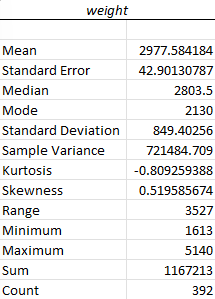

## Descriptive Statistics using **Analysis ToolPak**
* Descriptive statistics summarize a dataset using measures of central tendency, variability, and some basic summary statistics like _minimum, maximum, and range_.
1. Select the variable you want to see the statistics for, then **Data > Analyze > Data Analysis** 
2. select **Descriptive Statistics** 
3. ensure **Labels in the First Row** is checked
4. under **Output options** enable **Summary statistics**
6. Then you'll get a nice table like this! 

   

