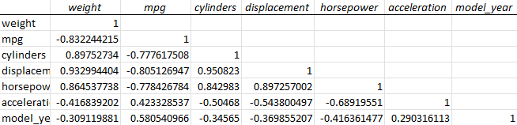

## Descriptive Statistics using **Analysis ToolPak**
* Descriptive statistics summarize a dataset using measures of central tendency, variability, and some basic summary statistics like _minimum, maximum, and range_.
1. Select the variable you want to see the statistics for, then **Data > Analyze > Data Analysis** 
2. select **Descriptive Statistics** 
3. ensure **Labels in the First Row** is checked
4. under **Output options** enable **Summary statistics**
6. Then you'll get a nice table like this! 

   

### Correlation Analysis
* Correlation is the measure between 2 quantitative variables, so you don't want to include categorical variables. 
  * In my studies for my Psychology degree, we used these type of statistics (correlation coefficient/Pearson correlation coefficient) in my Research Statistics classes! It's cool that its showing up again here, a little bit of a throwback for me 😆

#### Analysis ToolPak Instructions
1. Select **Correlation** from the **Data Analysis** window
2. In the window that appears, set the following:
   1. **Input Range** to include all **quantitative columns** (w/ their labels)
   2. Enable **Labels in First Row**
   3. **Output options** to **New Worksheet Ply**
3. Now you will have a **correlation matrix** that consists of the *correlation coefficients* between each *quantitative variable.* 



* **Linear regression** can be used to fit a line summarizing the relationship of an independent anddependent variable. 

#### How to Interpret the **Correlation Coefficient**
  * It can be between ```-1``` and ```1```
  * A correlation of ```-1``` = perfect negative correlation, **as one variable increases, the other decreases**
  * A correlation of ```1``` = perfect positive correlation, **as one variable increases, so does the other**
  * A correlation of ```0``` means there is no correlation


