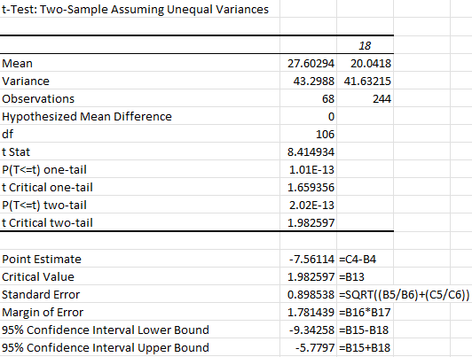
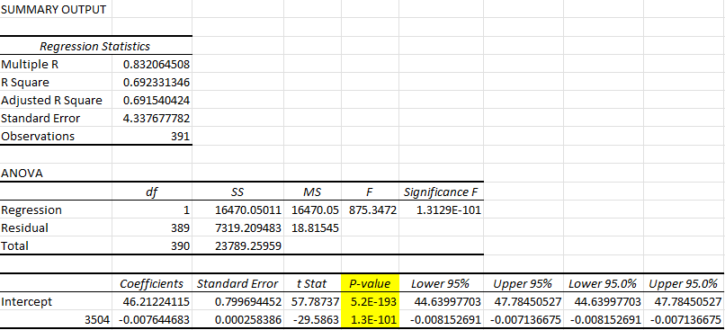

## Descriptive Statistics using **Analysis ToolPak**
* Descriptive statistics summarize a dataset using measures of central tendency, variability, and some basic summary statistics like _minimum, maximum, and range_.
1. Select the variable you want to see the statistics for, then **Data > Analyze > Data Analysis** 
2. select **Descriptive Statistics** 
3. ensure **Labels in the First Row** is checked
4. under **Output options** enable **Summary statistics**
6. Then you'll get a nice table like this! 

   

### Correlation Analysis
* Correlation is the measure between 2 quantitative variables, so you don't want to include categorical variables. 
  * In my studies for my Psychology degree, we used these type of statistics (correlation coefficient/Pearson correlation coefficient) in my Research Statistics classes! It's cool that its showing up again here, a little bit of a throwback for me 😆

#### Analysis ToolPak Instructions
1. Select **Correlation** from the **Data Analysis** window
2. In the window that appears, set the following:
   1. **Input Range** to include all **quantitative columns** (w/ their labels)
   2. Enable **Labels in First Row**
   3. **Output options** to **New Worksheet Ply**
3. Now you will have a **correlation matrix** that consists of the *correlation coefficients* between each *quantitative variable.* 


* **Linear regression** can be used to fit a line summarizing the relationship of an independent anddependent variable. 

#### How to Interpret the **Correlation Coefficient**
  * It can be between ```-1``` and ```1```
  * A correlation of ```-1``` = perfect negative correlation, **as one variable increases, the other decreases**
  * A correlation of ```1``` = perfect positive correlation, **as one variable increases, so does the other**
  * A correlation of ```0``` means there is no correlation

---
## Confirmatory Data Analysis

### Independent Samples T-test
*I'll be honest this type of analysis is still a bit confusing to me, but I'll still document my learning so far!* 

* As the **sample size increases**, the **sample mean** will get closer to the **true population mean**. 
  * Our **sample means** will be **normally distributed** as long as the sample size is **large** enough. 
  * However, we can be 95% confident that it will be +/- 2 standard deviations of the mean
    * This value is the **p-value** 

### P-value 
1. If the **p-value** is less than ```0.05``` we can conclude that the analysis of the sample will likely be seen in the population too. This ```0.05``` threshold is often called the **alpha** 
2. We can use a **two-sample independent t-test** to determind if there's a significant difference between two means 
   1. If the results of the t-test show that the ```p-value > alpha``` then there is a **difference between the two means**
   2. If the results show that ```p-value < alpha``` then there is **no statistical difference** between the two means 



Using the **two sample t-test** and **adding confidence intervals** *(shown as 95% confidence interval lower/upper bound)* we can determine with **95% confidence** that the **difference between European miles per gallon (mpg) and USA's mpg** is ```9.35mpg and 5.79mpg```

* There's another way to test the significane of one continuous variable on another using linear regression! 


### Linear Regression
Using the **Regression Data Analysis** in Excel will generate a table like so:


By looking at the p-value, its easy to see that one value has a strong effect on the other value (in this example, weight of the car greatly affects mpg)

* The objective of **linear regression** is to fit a line **summarizing the relationship** between the **independent and dependent variables** 
   * You can do this in Excel by adding a **Trendline** to a scatter plot
   * The R-squared and Equation of the line can then be displayed, with the slope and y-intercept being the same values under ```Coefficients``` in the earlier table. You can then use the Equation of the line to make predictions about the data
