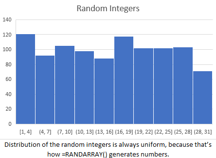

**Handy Excel Functions Ahead!**

### MEDIAN()
```=MEDIAN()```
* calculating the median helps when there is a huge outlier so averages aren’t skewed to the high outliers 

---
### VLOOKUP() 
```=VLOOKUP(value_to_find, starting_column_to_find_it, index_for_return_value, false)```

*  value_to_find: The value you're trying to find
*  starting_column_to_find_it: The range, starting with the column that includes the value you're trying to find
*  index_for_return_value: The index number of the range where your answer is located
*  false: An exact (FALSE) or approximate (TRUE) return value

---
### AVERAGEIF() 
```=AVERAGEIFS(average_range, criteria_range1, criteria1, [criteria_range2, criteria2], ...)```
* Uses multiple criteria to determine which values it should act upon
#### How to Use AVERAGEIFS in Excel
1. **Set up a table** where you'll store the average results.
2. Use the AVERAGEIFS function to calculate the average based on conditions.
3. **average_range** – choose the column with the numbers you want to average (e.g., windspeed).
4. **criteria_range1** – pick the first condition column (like "Season") and specify the value to filter by (e.g., 1, 2, 3...).
5. **criteria_range2** – pick a second condition column (like "Year") and its specific value (e.g., 2020, 2021...).

---
### =DATEDIF()
```=DATEDIF(A1, B1, "d")``` 
* Calculate the difference between two dates in days. "d" is # of days, "m" is # of months

---
### =UNIQUE()
```=UNIQUE()```
* Lists all distinct values in any range, aka the unique values
* Wrap it inside the ```=COUNTA()``` function to find the number(count) of distinct values 
  * ```=COUNTA(UNIQUE(products[country_of_origin]))```

### =RANDARRAY()
```=RANDARRAY()```
* Creates random data you can experiment with!
  * ```=RANDARRAY(100, 1, 1, 30, TRUE)``` will generate 100 random integers between 1 and 30. 




## 🔢Counting Functions 🔢
```=COUNT(value1, [value2], ...)```
* Counts the number of cells that contain numbers

```=COUNTA(value1, [value2], ...)```
* Counts the number of cells that contain text data

```=COUNTIF(range, criteria)```
* Counts the number of cells that meet a specific condition

```=COUNTIFS(criteria_range1, criteria1, [criteria_range2, criteria2], ...)```
* Counts the number of cells that meet multiple conditions

```=COUNTBLANK(range)```
* Counts the number of empty cells in a range

`=COUNTA(UNIQUE(range))`
* Counts the number of unique values in a range


## 🧠Logical Functions 🧠
* These are Excel's "if" statements, which return a value based on whether a condition is true or false
  * TRUE = 1, FALSE = 0

---

### ⚖️ =IF( ) ⚖️
```=IF(logical_test, value_if_true, value_if_false)```
  * Performs a logical test and returns one value if true and another if false
  * *Example*: `=IF(A1 > 10, "High", "Low")` returns "High" if A1 is greater than 10, otherwise it returns "Low"

* **Nested IF functions** allow you to include **multiple** logical tests** within a single formula
  * *Example*: `=IF([@Status]<>"Delayed", "", IF([@[Arrival Delay]]>120, "Severe", IF([@[Arrival Delay]]>60, "Major", "Moderate")))`
    * This function checks the "Status" column first, and if it's not "Delayed", it returns an empty cell. If the Arrival Delay is greater than 120, it returns "Severe", if it's greater than 60, it returns "Major", otherwise it returns "Moderate".
   * **Note**: Nested IFs can become complex, so consider using other functions like IFS for multiple conditions.
  
---
### 🔗 =AND( ) 🔗
```=AND(logical1, [logical2], ...)```
  * Returns TRUE if all conditions are true, otherwise returns FALSE
  * *Example*: `=AND(A1 > 10, B1 < 5)` returns TRUE if both conditions are met

---

###  =OR( ) 
```=OR(logical1, [logical2], ...)```
  * Returns TRUE if at least one condition is true, otherwise returns FALSE
  * *Example*: `=OR(A1 > 10, B1 < 5)` returns TRUE if either condition is met

---

###  =NOT( ) 
```=NOT(logical)```
  * Reverses the logical value of its argument
  * *Example*: `=NOT(A1 > 10)` returns TRUE if A1 is not greater than 10

---

###  =IFERROR( ) 
```=IFERROR(value, value_if_error)```
  * Returns a specified value if the formula results in an error; otherwise, it returns the result of the formula
  * *Example*: `=IFERROR(A1/B1, "Error")` returns "Error" if A1/B1 results in an error (like division by zero)