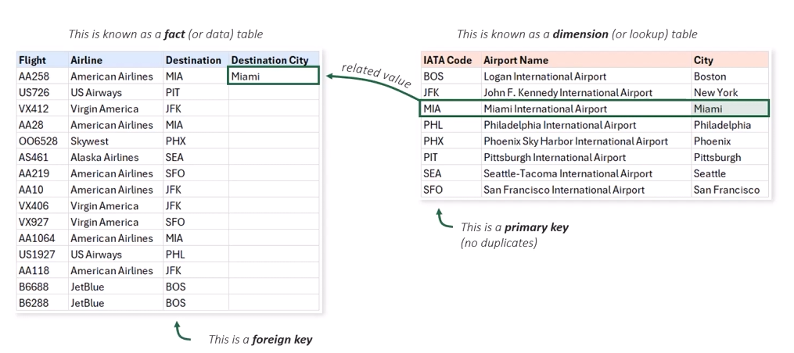

**Handy Excel Functions Ahead!**

## 🔢Counting Functions 🔢
These functions let you perform basic math calculations on cells that match a specific criteria.

### ➕ =SUMIFS( ) ➕
```=SUMIFS(sum_range, criteria_range1, criteria1, [criteria_range2, criteria2], ...)```
* Adds up all the values in a range that meet one or more criteria

### ➗ =AVERAGEIFS( ) ➗
```=AVERAGEIFS(average_range, criteria_range1, criteria1, [criteria_range2, criteria2], ...)```
#### How to Use AVERAGEIFS in Excel
1. **Set up a table** where you'll store the average results.
2. Use the AVERAGEIFS function to calculate the average based on conditions.
3. **average_range** – choose the column with the numbers you want to average (e.g., windspeed).
4. **criteria_range1** – pick the first condition column (like "Season") and specify the value to filter by (e.g., 1, 2, 3...).
5. **criteria_range2** – pick a second condition column (like "Year") and its specific value (e.g., 2020, 2021...).

### 🔢 =COUNTIFS( ) 🔢
```=COUNTIFS(criteria_range1, criteria1, [criteria_range2, criteria2], ...)```
* Counts the number of cells that meet one or more criteria
  * **Example:** ```=COUNTIFS(Flights[Airline], B9#, Flights[Status], "On Time")```
  * This function counts the number of flights for a specific airline that are on time. You can utilize this with a table to dynamically reference the airline name in cell B9.

---

## 🧠Logical Functions 🧠
* These are Excel's "if" statements, which return a value based on whether a condition is true or false
  * TRUE = 1, FALSE = 0

### ⚖️ =IF( ) ⚖️
```=IF(logical_test, value_if_true, value_if_false)```
  * Performs a logical test and returns one value if true and another if false
  * **Example**: `=IF(A1 > 10, "High", "Low")` returns "High" if A1 is greater than 10, otherwise it returns "Low"

* **Nested IF functions** allow you to include **multiple** logical tests** within a single formula
  * **Example**: `=IF([@Status]<>"Delayed", "", IF([@[Arrival Delay]]>120, "Severe", IF([@[Arrival Delay]]>60, "Major", "Moderate")))`
    * This function checks the "Status" column first, and if it's not "Delayed", it returns an empty cell. If the Arrival Delay is greater than 120, it returns "Severe", if it's greater than 60, it returns "Major", otherwise it returns "Moderate".
   * **Note**: Nested IFs can become complex, so consider using other functions like IFS for multiple conditions.

### 🔗 =AND( ) 🔗
```=AND(logical1, [logical2], ...)```
  * Returns TRUE if all conditions are true, otherwise returns FALSE
  * **Example**: ```=IF(OR(AND([@Status]="Cancelled",[@[Cancellation Reason]]="Airline"),[@[Delay Type]]="Severe"), "Yes", "No")```
    * This function checks if the flight Status is "Cancelled" and if the Delay Type is "Severe", and if the Cancellation Reason is "Airline", then it returns "No", otherwise it returns "Yes".

### ❌ =IFERROR( ) ❌
```=IFERROR(value, value_if_error)```
  * Returns a specified value if the formula results in an error; otherwise, it returns the result of the formula
  * **Example**: ```=IFERROR([@Distance]/[@[Length (hr)]], "")```
    * This function checks if the division of Distance by Length (hr) results in an error (#DIV/0!). If it does, it returns an empty string; otherwise, it returns the Average Speed. 
    * Usually it's better to keep the cells blank if an error occurs, rather than displaying an error message.

###  =OR( ) 
```=OR(logical1, [logical2], ...)```
  * Returns TRUE if at least one condition is true, otherwise returns FALSE
  * **Example**: `=OR(A1 > 10, B1 < 5)` returns TRUE if either condition is met

###  =NOT( ) 
```=NOT(logical)```
  * Reverses the logical value of its argument
  * **Example**: `=NOT(A1 > 10)` returns TRUE if A1 is not greater than 10

## 🔍 Lookup Functions🔍
* Find or match a **lookup value** in a column and return a related value in another column from the same row. 
*  **Dimension Tables** contain primary keys which are unique identifiers for each row, and **Fact Tables** contain foreign keys that reference the primary keys in dimension tables.



### 👀 =VLOOKUP( ) 👀
```=VLOOKUP(value_to_find, starting_column_to_find_it, index_for_return_value, false)```
*  value_to_find: The value you're trying to find
*  starting_column_to_find_it: The range, starting with the column that includes the value you're trying to find
*  index_for_return_value: The index number of the range where your answer is located
*  false: An exact (FALSE) or approximate (TRUE) return value

### 🪄 =XLOOKUP( ) 🪄
```=XLOOKUP(lookup_value, lookup_array, return_array, [if_not_found], [match_mode], [search_mode])```
* A more powerful and flexible replacement for VLOOKUP
  * **lookup_value**: The value you want to find
  * **lookup_array**: The range of cells to search for the lookup value
  * **return_array**: The range of cells from which to return a value
  * **if_not_found**: The value to return if the lookup value is not found
  * **match_mode**: The type of match to perform (exact or approximate)
  * **search_mode**: The direction to search (first-to-last or last-to-first)
⭐ Pro Tip: If you put a `.` before the array you want to return, it will automatically fill ONLY the unique values from that array (makes it more efficient)

## Date & Time Functions
### 🕦 =TODAY( ) & =NOW( ) 🕥
```=TODAY()``` 
* Returns the current date:`7/15/2025`

```=NOW()```
* Returns the current date and time:`7/15/2025 18:29`

### 🗓️ =YEAR (), =MONTH(), =DAY( ) 🗓️
```=YEAR(A1)```
* Returns the year of a date
```=MONTH(A1)```
* Returns the month of a date
```=DAY(A1)```
* Returns the day of a date

### ⌛ =HOUR ( ), =MINUTE( ) =SECOND( ) ⌛
```=HOUR(A1)```
* Returns the hour of a time
```=MINUTE(A1)```
* Returns the minute of a time
```=SECOND(A1)```
* Returns the second of a time

### ⏲️ =WEEKNUM( ) & =WEEKDAY( ) ⏲️
```=WEEKNUM(A1)```
* Returns the week number of a date (1-53)
```=WEEKDAY(A1)```
* Returns the day of the week for a date (1-7)

### ➖ =DATEDIF( ) ➖
```=DATEDIF(A1, B1, "d")```
* Calculate the difference between two dates in days. "d" is # of days, "m" is # of months

## ✍️ Text Functions ✍️

### ⏫ =UPPER( ) ⏫
```=UPPER(text```
* Converts text to uppercase  
  
### ⏬ =LOWER( ) ⏬
```=LOWER(text```
* Converts text to lowercase
  
### 🔠 =PROPER( ) 🔠
```=PROPER(text```
* Converts text to proper case (first letter of each word capitalized)
  
### ✂️ =TRIM( ) ✂️
```=TRIM(text```
* Removes extra spaces from text, leaving only single spaces between words
  
### ➡️ =LEFT( ), =RIGHT( ), =MID( ) ➡️
```=LEFT(text, start, characters`
* Returns the leftmost characters from a text string
```=RIGHT(text, characters)`
* Returns the rightmost characters from a text string
```=MID(text, start, characters)` 
* Returns a specific number of characters from a text string, starting at a specified position
  
### =TEXTBEFORE( ), =TEXTAFTER( )
```=TEXTBEFORE(text, delimiter, [ ])```
* Returns the text before a specified delimiter
`=TEXTAFTER(text, delimiter, [instance_num], [ignore_case])`
* Returns the text after a specified delimiter
```=TEXTAFTER(text, delimiter, [ ])```
* Returns the text after a specified delimiter

### ✂️ =TEXTSPLIT( ) ✂️
```=TEXTSPLIT(text, delimiter, [...])```
* Splits text into an array based on a specified delimiter
  
### ▶️ =TEXTJOIN( ) ◀️
```=TEXTJOIN(", ", TRUE, A1:A5)```
* Joins text from multiple cells into a single cell, with a specified delimiter
* 
⭐Pro Tip: Use `&` to concatenate text in Excel, e.g., `=A1 & " " & B1` to combine values from A1 and B1 with a space in between.


---

## Misc Functions (Not Organized Yet)

### =RANDARRAY()
```=RANDARRAY()```
* Creates random data you can experiment with!
  * ```=RANDARRAY(100, 1, 1, 30, TRUE)``` will generate 100 random integers between 1 and 30. 


