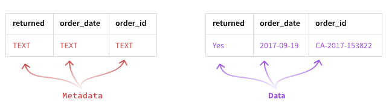

## SQLite terminology:

- **Integer** for integer numbers, like the values in the quantity field.
- **Real** for floating point values (or floats). Think of these as decimal numbers, like the values in the sales field.
- **Text** or *strings* for regular text values, like the values in the ```order_date, order_id, and product_name``` fields.


### Retrieve Name and Data Type
- You can use ```PRAGMA table_info(returns);``` to retrieve the **metadata** from a table
- 
